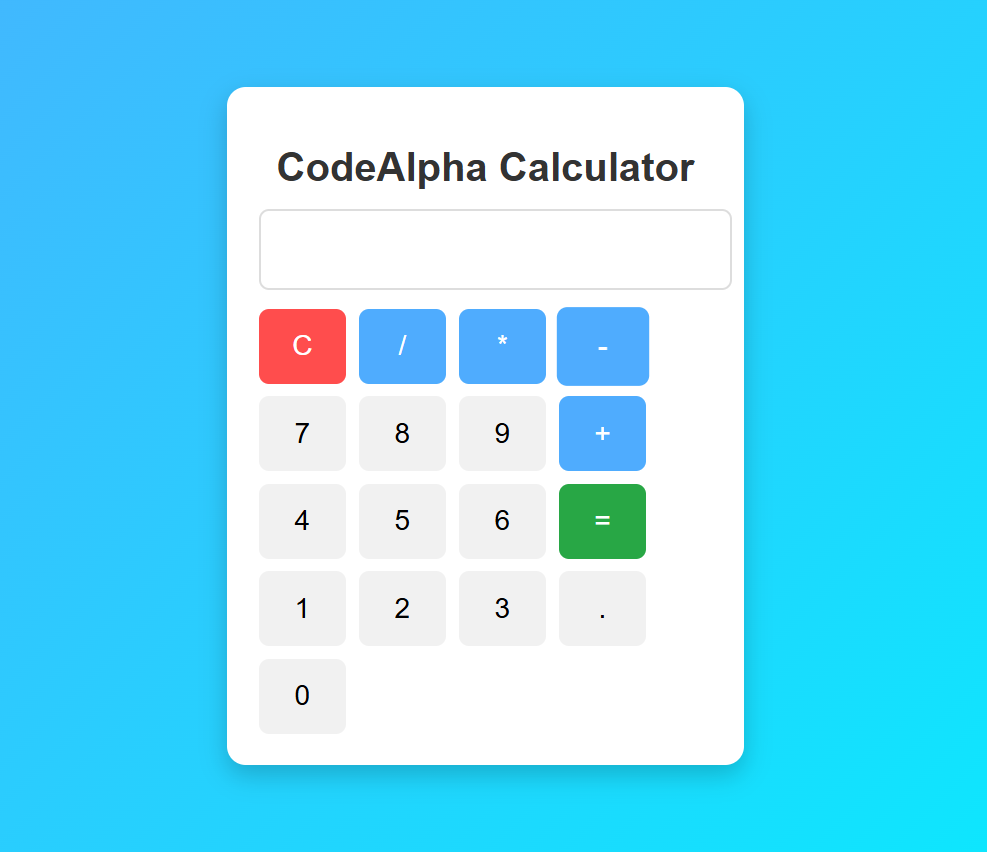

# CodeAlpha Calculator

A simple calculator developed using HTML, CSS, and JavaScript as part of the CodeAlpha Frontend Development Internship.
## Screenshot

## Features

* Addition
* Subtraction
* Multiplication
* Division
* Clear Function
* Responsive Design
* Interactive User Interface

## Technologies Used

* HTML5
* CSS3
* JavaScript

## Live Demo

https://yashwanthpakala.github.io/CodeAlpha_Calculator/

## Author

Pakala Yashwanth

Frontend Development Intern - CodeAlpha
